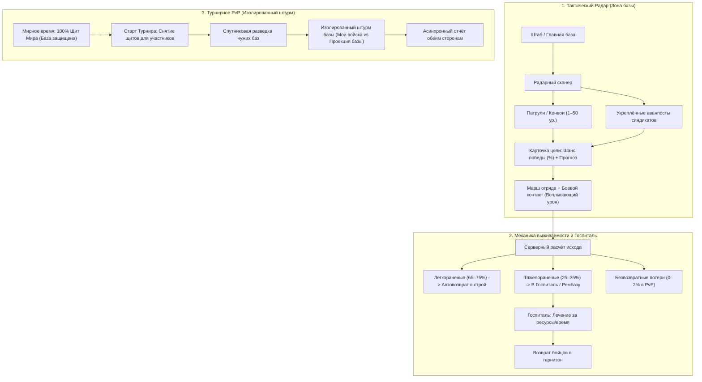
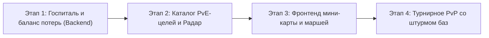

# План модернизации военной системы: Тактический Радар, Госпитали и Турнирное PvP

Документ описывает архитектуру и концепт новой военной системы игры **НАТБИРЖА**. Цель обновления — заменить текущий статичный список корпораций на интерактивный тактический радар, внедрить систему госпиталей для защиты армии от мгновенного уничтожения и реализовать производительное PvP без рассинхронов и серверных задержек.

---

## 1. Архитектурная схема системы

---

## 2. Тактический Радар базы (Компактная зона без лагов)

### 2.1. Концепция зоны видимости
* Экран оформлен как **тактический голографический радар** зоны ответственности военной базы игрока.
* В центре поля расположен **Штаб игрока** (главное военное здание).
* Карта **не имеет бесконечной прокрутки**: отображается фиксированный радиус наблюдения (1 500–2 000 м). Это гарантирует стабильные 60 FPS на мобильных устройствах в Telegram WebApp и исключает утечки оперативной памяти.

### 2.2. Механика поиска целей (Сканер)
Игрок открывает интерфейс сканера и задаёт параметры поиска:
1. **Категория цели**:
   * 🤖 **Патрули наёмников / Рейдеры** (одиночные отряды, динамический уровень 1–50, быстрый фарм).
   * 🏢 **Укреплённые аванпосты / Техно-форты Синдиката** (тяжёлые укрепления, гарнизоны с артиллерией и дронами, ценный лут: чертежи, компоненты, сырьё).
2. **Уровень цели**:
   * Слайдер выбора уровня (от 1 до максимально открытого игроком).
   * Победа над текущим максимальным уровнем открывает доступ к следующему тиру противников.
3. **Спавн**:
   * По нажатию «Сканировать» радар генерирует импульсную волну, и в свободной координате сектора появляется маркер цели с шестиугольным бейджем уровня и шкалой прочности.

### 2.3. Информационная карточка и прогноз боя
При нажатии на обнаруженную цель открывается модальное окно разведки:
* **Боевой рейтинг цели vs Боевой рейтинг отряда игрока**.
* **Шанс победы (%)**:
  * 🟢 `90% – 100%`: *Подавляющее преимущество*
  * 🟡 `65% – 89%`: *Уверенная победа*
  * 🟠 `40% – 64%`: *Высокий риск потерь*
  * 🔴 `< 40%`: *Смертельная опасность*
* **Прогноз потерь**: ориентировочное количество раненых до отправки войск.
* **Список трофеев**: cash, опыт военного дела, металлы, микрочипы, чертежи улучшений.

### 2.4. Анимация марша и перестрелки
* При отправке отряда по радару прокладывается векторная линия движения отряда от Штаба к цели.
* При сближении активируется компактная анимация огневого контакта со **всплывающими цифрами урона** (`-540`, `-780`), индикаторами критов и эффектов бронебойности.
* По окончании боя отряд возвращается на базу, доставляя захваченную добычу.

---

## 3. Военный Госпиталь и балансировка потерь

> [!IMPORTANT]
> Главная цель механики ранений — устранить потерю 90% армии при поражении, дав игрокам возможность сохранять и восстанавливать армию после сложных сражений.

### 3.1. Трёхкомпонентное разделение потерь

| Тип потерь | Доля (PvE-бои) | Доля (PvP-турниры) | Механика обработки |
|---|:---:|:---:|---|
| **Легкораненые** | **65% – 75%** | **50% – 60%** | Возвращаются в гарнизон сразу после боя **автоматически и бесплатно**. |
| **Тяжелораненые** | **25% – 35%** | **35% – 45%** | Поступают в **Госпиталь** (пехота, пограничники) или **Рембазу** (бронетехника, дроны). |
| **Безвозвратные** | **0% – 2%** | **5% – 10%** | Полная гибель. *В PvE равна 0%, если в госпитале есть свободные койко-места.* |

### 3.2. Военная инфраструктура спасения
1. **Военный Госпиталь (Hospital)**:
   * Специализация: людские ресурсы (Пехота, Пограничники).
   * Вместимость: базовая емкость 500 мест на 1 уровне (+500 мест за каждый уровень здания).
   * Процесс лечения: игрок выбирает количество бойцов для исцеления. Лечение требует небольшого количества cash/медикаментов и времени либо завершается мгновенно за ресурсы.
2. **Ремонтный ангар / Мастерские (Repair Depot)**:
   * Специализация: техника (Танки, БМП, Дроны, ПВО).
   * Ремонт повреждённых машин за сталь, электронику и машиностроительные ресурсы.
3. **Лимит переполнения**:
   * Если госпиталь заполнен на 100%, новые тяжелораненые бойцы переходят в категорию безвозвратных потерь. Это стимулирует своевременно лечить бойцов и расширять палаты.

---

## 4. Щиты Мира и Турнирные PvP-штурмы

### 4.1. Постоянный Щит Мира (Peace Protocol)
* В обычное время на базы всех игроков наложен автоматический бессрочный **Щит Мира**.
* Базы игроков нельзя атаковать вне турниров: экономика, фабрики и склады надёжно защищены от нежелательных набегов.

### 4.2. Турнирный режим: Спутниковая разведка и Изолированный штурм
Во время проведения официальных военных турниров:
1. Участники турнира получают временный статус боевой готовности.
2. **Спутниковая разведка**:
   * Игрок сканирует сектор и находит базы подходящих по силе оппонентов.
   * Отображается уровень штаба противника, оборонительные вышки и приблизительный размер гарнизона.
3. **Изолированная сессия боя (Zero-Lag Client Architecture)**:
   * При атаке игрок видит тактическую проекцию базы соперника: стены, вышки и защищающий гарнизон.
   * **Между игроками нет прямого сетевого соединения в реальном времени**: защитнику не требуется быть онлайн, сервер не поддерживает тяжёлые сокетные каналы 60 FPS.
   * Клиент атакующего визуализирует тактический штурм, а сервер одним валидирующим запросом фиксирует результаты боя.
4. **Уведомление и компенсация**:
   * Защитник получает подробный боевой отчёт в игре и уведомление от Telegram-бота:
     > *«🚨 Зафиксирована атака на базу игроком @username! Гарнизон удержал оборону / База повреждена. 140 бойцов направлены в Госпиталь на восстановление.»*
   * Защитник переходит в госпиталь и восстанавливает раненых бойцов.

---

## 5. Поэтапный план технической реализации

### Этап 1: Инфраструктура Госпиталя и новая формула потерь
* **База данных**:
  * Таблица `nat_hospital_wards` (`company_id`, `unit_type`, `wounded_count`, `healed_at`, `status`).
  * Добавление параметров `hospital_level` и `repair_depot_level` в `NatMilitaryInfrastructure`.
* **Сервис `HospitalService` (`backend/natbirzha/services/hospital_service.py`)**:
  * Приём тяжелораненых с проверкой лимита коек.
  * Запуск и ускорение циклов лечения.
* **Обновление `combat_resolver.py`**:
  * Внедрение функции разделения урона на лёгкие ранения, госпитализацию и гибель.

### Этап 2: Бэкенд Радара и алгоритмы шанса победы
* **Каталог целей (`backend/natbirzha/catalogs/pve_encounters.py`)**:
  * Прогрессия уровней 1–50: лёгкие патрули, моторизованные банды, укреплённые аванпосты синдиката.
  * Таблицы наград (опыт, cash, ресурсы, технологии).
* **Сервис `PveRadarService` (`backend/natbirzha/services/pve_radar_service.py`)**:
  * Спавн целей в полярных координатах вокруг Штаба.
  * Точный математический расчёт шанса победы на основе сопоставления родов войск и боевой мощи.

### Этап 3: Клиентский интерфейс Радара и Госпиталя
* **Модуль `military_radar.js`**:
  * Отрисовка тактической карты (сетка, радарные волны, Штаб, маркеры целей).
  * Карточка разведданных с цветовым индикатором шанса победы (зелёный/жёлтый/красный).
  * Анимация движения отряда и всплывающего урона.
* **Модуль `military_hospital.js`**:
  * Интерфейс палат госпиталя и ремонтных боксов.
  * Кнопки «Вылечить всех» и «Мгновенное лечение».

### Этап 4: Турнирное PvP и штурмы баз
* Интеграция спутниковой разведки в турнирные раунды.
* Логика снятия Щитов Мира для зарегистрированных участников.
* Генерация проекций баз оппонентов и сохранение истории штурмов.

---

## 6. Соответствие стандартам кодовой базы

1. **Лимит строк (SRP)**:
   * Все новые сервисы и роутеры разделяются по доменам (`hospital_service.py`, `pve_radar_service.py`, `military_radar.js`, `military_hospital.js`), оставаясь в пределах 150–300 строк.
2. **Обратная совместимость**:
   * Существующие юниты (`NatArmy`: пехота, танки, дроны, пограничники, авиация, ПВО) и турнирные механики полностью сохраняются.
3. **Верификационный протокол**:
   * Запуск тестов `python tests/test_suite.py` после каждого этапа с обязательным статусом `ZERO ERRORS`.
